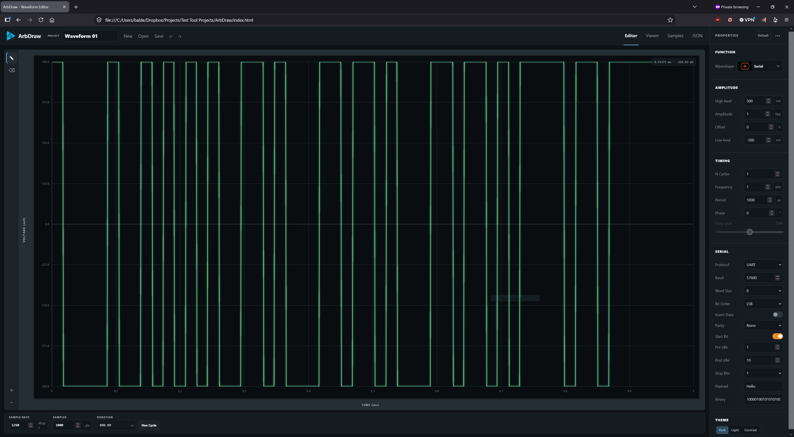

# ArbDraw

Vibe coded, but actually useful, arbitrary waveform editor.

## Try it online

Access the GitHub-hosted version at [baldengineer.github.io/arbdraw](https://baldengineer.github.io/arbdraw/).

## Run

No build step or third-party dependencies are required.

## Python instrument bridge

The **Instruments** button connects ArbDraw to a local Python REST service. From the app, users can discover VISA resources, issue `*IDN?`, and send the current waveform to a configured instrument adapter.

Start the bridge and a local copy of ArbDraw with `python -m python_bridge --serve-app .`. PyVISA is only required for VISA operations. See [python_bridge/README.md](python_bridge/README.md) for setup, API endpoints, and the adapter hook for existing waveform utilities.

## Features

- Sine, square, pulse, triangle with adjustable symmetry (including rising/falling ramps), white/pink noise, custom, and serial (UART) waveform types
- Fixed, evenly spaced voltage points (with frequency and period stored as instrument metadata)
- Generator profiles, including Audio at 48 kHz with 1,000 default points and a 100,000-point maximum
- CSV export with optional waveform metadata headers
- SVG export with black lines on a transparent background and optional time/voltage axes and grid
- WAV export as mono 16-bit PCM at the current sample rate, with peak normalization (use the Audio profile for 48 kHz)
- Browser audio playback with a Play/Stop control and automatic output-rate conversion
- Optional noise, low-pass, and smoothing filters with adjustable settings
- Undo and redo for waveform changes
- Freehand, line, and erase editing
- Waveform Viewer (to simulate what you'd see on an oscilloscope)
- Serial pulse-train generation from protocol, baud, word size, parity, framing, and payload controls
- Adjustable rise and fall times for square, pulse, and serial waveforms, with linear ramps limited by the next opposite edge

## ArbDraw Files

The editor keeps a versioned `arbdraw.waveform` document in memory as its source of truth.

## URL parameters

The initial waveform can be selected and configured from the URL. URL parameters override saved browser settings. For example:

`?waveshape=triangle&frequencyHz=1000&nCycles=2&symmetryPercent=25`

Parameters use the same names as the editable defaults in `js/defaults.js`. `wave`, `waveshape`, `waveform`, and `type` are aliases for `waveformType`; `frequency` and `period` are aliases for `frequencyHz` and `periodSeconds`. If both frequency and period are supplied, frequency takes precedence so the linked controls remain synchronized.

- Use **Save** to download an `.arbdraw.json` project containing waveform parameters and sample values.
- Use **Open** to restore a project from a JSON file or pasted JSON text.

See [ArbDraw_JSON_Format.md](ArbDraw_JSON_Format.md) for the complete field reference, units, import rules, timing formulas, and a Python reader example.

(Transient UI state such as the selected drawing tool, zoom, and undo history is intentionally not stored in the project document.)

## Exporting waveforms

Choose **Export Waveform**, select **CSV**, **SVG**, or **WAV**, and enter a filename.

- **CSV** exports time and voltage samples, with optional metadata headers.
- **SVG** exports black waveform lines on a transparent background, with optional axes and grid.
- **WAV** exports the current samples as mono, 16-bit PCM audio. Sample values are normalized so the largest absolute value reaches full scale; silence remains silent.

### Audio and WAV export

1. Select **Audio** in **AWG Profile** before creating your waveform. This sets the sample rate to **48 kHz** and the sample count to **1,000**, with a maximum of **100,000** points.
2. Adjust the sample count and create or edit your waveform.
3. Use **Play** in the AWG controls to hear the waveform through the browser. Playback follows the configured frequency and repeats until you select **Stop**.
4. Choose **Export Waveform → WAV**, enter a filename, and select **Export WAV**.

The WAV sample rate comes from the current waveform settings and is shown in the export dialog. The exporter accepts rates from **8 to 384 kHz**. Hardware generator profiles can use much higher rates, so select the Audio profile when preparing audio files for applications such as Adobe Audition.

The file contains one copy of the sample buffer. At 48 kHz, 1,000 points lasts about **20.8 ms**, and 100,000 points lasts about **2.08 seconds**. Selecting a profile resets the sample count to its default and regenerates the waveform, so choose the profile before editing.

## Editing defaults

Edit [`js/defaults.js`](js/defaults.js) to change the fallback waveform values used for new projects and incomplete imported projects. 

The defaults use a JavaScript object rather than fetched JSON so that the app also works when `index.html` is opened directly from disk.

## License

ArbDraw is available under the [MIT License](LICENSE).

