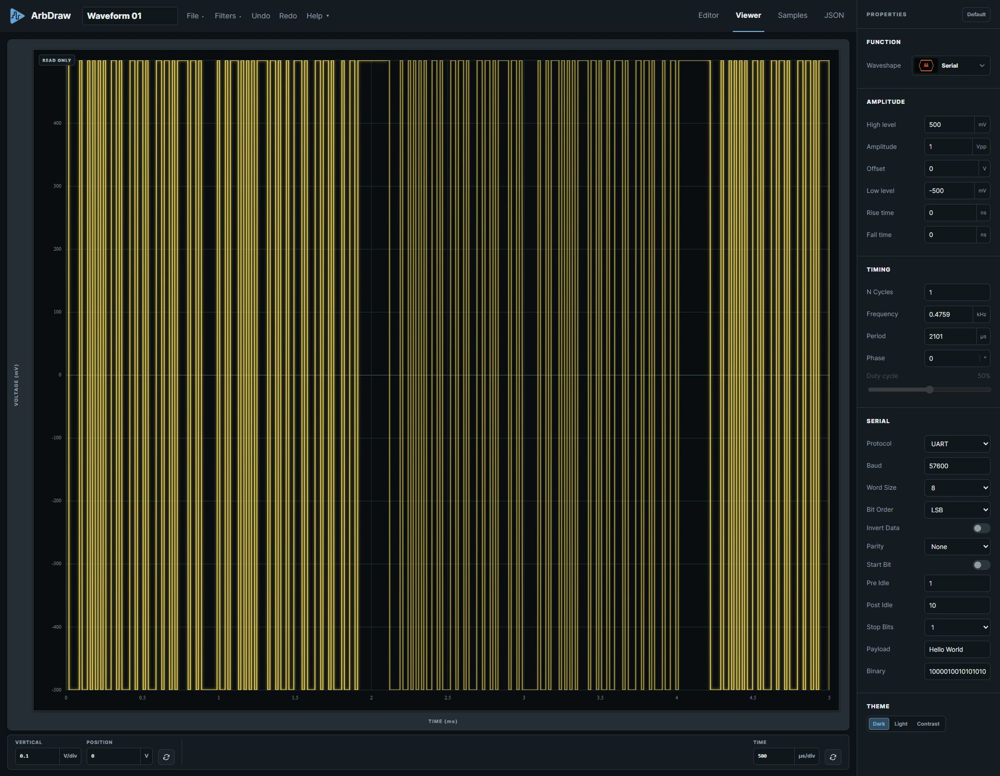
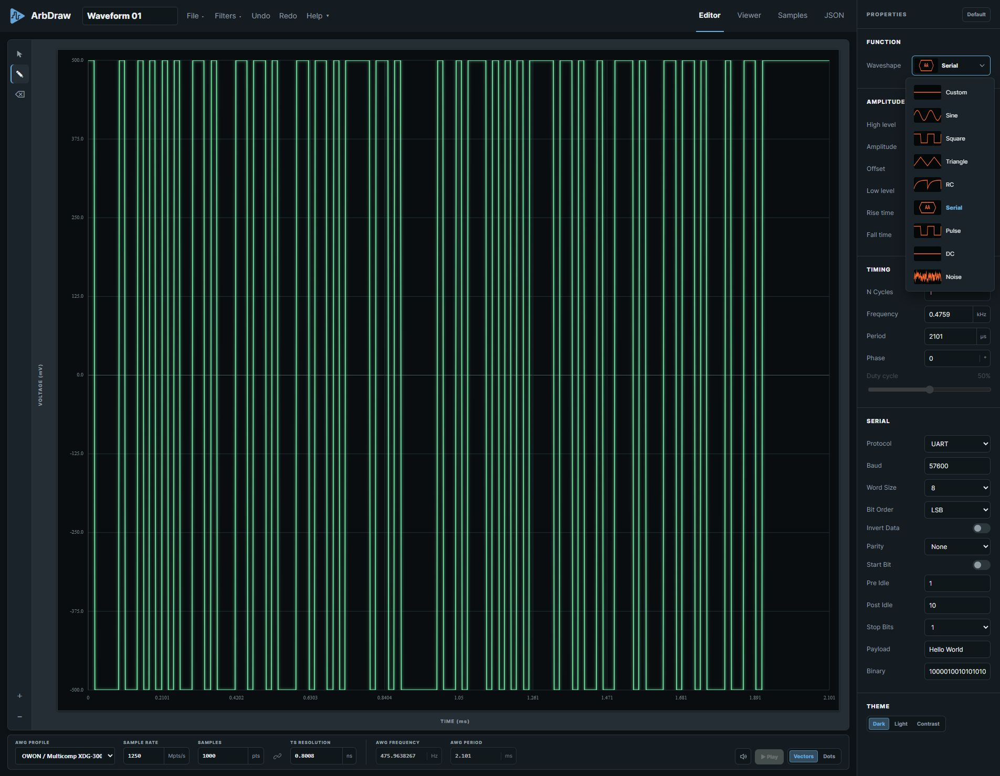
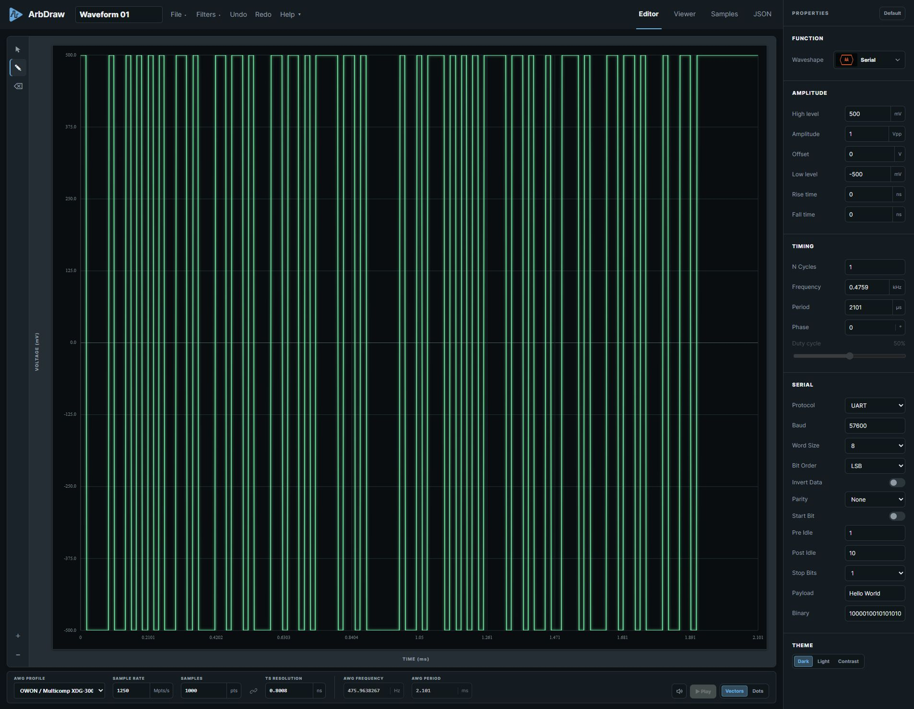

# Make a Waveform Misbehave on Purpose

## Five cool ArbDraw features for the bench

[featured-image][/featured-image]

Sometimes the test signal needs a flaw. A clean square wave is easy to generate, but a narrow glitch in the middle of it gives an oscilloscope something specific to trigger on. That is the kind of waveform I want to make without spending half an hour in an instrument menu.

[—More—]

I ran into a similar detail while checking a serial decode on a TekScope. A microcontroller UART uses 0 = LOW and 1 = HIGH logic, while RS-232 uses the opposite polarity convention. The data looked like UART, but the decoded characters were wrong until I could invert the data bits. That experience is why a checkbox labeled **Invert Data** is one of my favorite things in this editor.

ArbDraw is most useful when you *do something* with the samples. Here are five ways I use it, starting with a waveform you can draw on and ending with one you can type.

## 1. Draw a trigger signature anywhere

Choose a starting **Waveshape** such as Sine or Square. In the **Editor**, select the pencil-shaped **Edit** tool on the left, then drag across the trace where you want a change. The editor updates the samples under your stroke and changes the waveshape to **Custom**. A short notch, an extra edge, or a deliberately ugly pulse can become the signature for a scope trigger.

*Start with a generated shape, then use the Edit tool to alter the part that matters.*

I usually begin with a recognizable shape, add one glitch, and check it in **Viewer** before sending it to hardware. If the stroke misses, **Undo** is faster than rebuilding the whole wave. Keep enough samples for the glitch you drew: a feature narrower than your sample spacing will not survive a trip to an AWG.

## 2. Add a little noise

Open **Filters → Add Noise**, set a percentage, and apply it. The filter adds random vertical variation to the samples. I start small and increase it until the trace stops looking suspiciously perfect. The percentage is relative to the waveform's high-to-low span, so the same setting has a different voltage effect if you change those levels.

This is useful when testing a trigger or decoder against something closer to a captured signal than a mathematically exact line. You can turn the filter off again from **Filters** to compare clean and noisy versions. Noise is a test condition, not a substitute for measuring the real circuit.

## 3. Send samples with the Python bridge

When the instrument has a supported adapter, the optional Python bridge removes the file-export-and-import shuffle. Install and start the bridge on the computer connected to the instrument. Then open **File → Instruments**, connect to the local bridge, select the waveform backend and VISA resource, identify the instrument, and send the waveform. Check the channel and **Enable output** setting before you send it.

The bridge itself handles local VISA communication; an instrument-specific adapter handles the actual waveform transfer. The supported list is short today. If your instrument is missing, the [adapter guide](https://github.com/baldengineer/arbdraw/blob/main/python_bridge/ADAPTERS.md) explains how to build and register a bridge adapter. The editor and file exports still work without one.

## 4. Play the waveform without an AWG

Select **Audio** under **AWG Profile**, create a waveform, and press **Play** in the editor controls. Press **Stop** when you have heard enough. The Audio profile uses a 48 kHz sample rate, and playback happens in the browser through your computer's audio output. There is no Python bridge involved.

This is a handy way to hear a tone, sweep-like shape, or deliberately rough waveform when you do not have an AWG on the bench. The sound card is an audio output, though, not a calibrated voltage source. You can also export a mono WAV file from **File → Export Waveform** if another audio application is the next stop.

## 5. Type a string and get UART

Select **Serial** as the **Waveshape**, leave **Protocol** on **UART**, and type a string into **Payload**. Come on. Type a string, get UART. ArbDraw builds the bit pattern and the pulse train. Set the baud rate, word size, bit order, parity, start bit, stop bits, and idle intervals to match the device you are testing. You can enter hexadecimal bytes instead of text when the payload is not printable.

*Type the payload and adjust the framing; the waveform changes with it.*

Then check **Invert Data** if the data polarity needs to be flipped for your decoder. This was the TekScope case I mentioned earlier: microcontroller UART and RS-232 data conventions were at odds with the decode I wanted. The control flips the generated **data bits**; it does not convert the output into RS-232 voltage levels or invert the entire frame. That distinction matters when you connect real hardware.

One small usability detail keeps these experiments moving: ArbDraw saves settings in the browser's local storage between sessions. Save an `.arbdraw.json` project when you need the actual waveform back later. The JavaScript is also deliberately split into human-readable pieces, so if a control is almost what your bench needs, the source is practical to inspect and change.

The fun part is making a signal that answers a specific question: will the scope trigger on *this* glitch, will the decoder read *these* bytes, or will the design tolerate a little noise? Make that signal, inspect it, and then choose audio, a file, or the bridge to get it where it needs to go.

[reminder]What odd waveform or serial pattern would you make first?[/reminder]

[Try ArbDraw](https://baldengineer.github.io/arbdraw/) · [Source and documentation](https://github.com/baldengineer/arbdraw) · [Python bridge setup](https://github.com/baldengineer/arbdraw/blob/main/python_bridge/README.md) · [Build an instrument adapter](https://github.com/baldengineer/arbdraw/blob/main/python_bridge/ADAPTERS.md)
